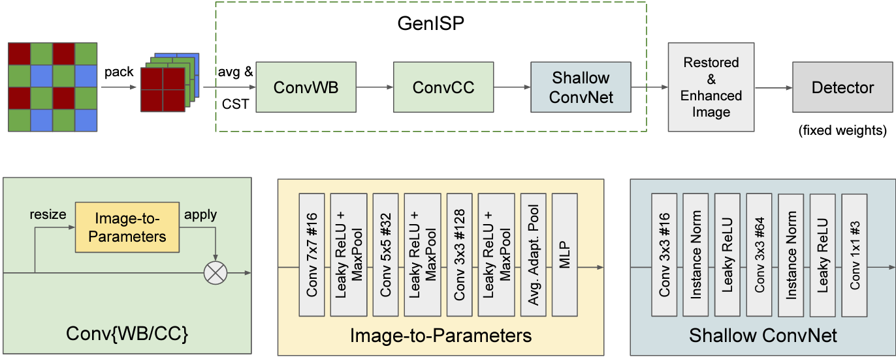
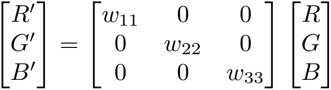
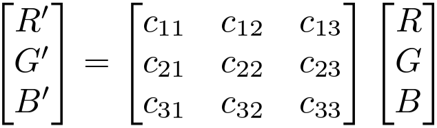

# Reproduction Paper of: 'GenISP: Neural ISP for Low-Light Machine Cognition'

Authors: 
- Thijs Exterkate 
- Tim Hoevenaar
- Jesse Tolen

This reproduction was part of the course CS4240 Deep Learning at Delft University of Technology

The original paper can be found at: https://arxiv.org/abs/2205.03688

## Introduction

Most studies in the computer vision community use image data that is already processed by the traditional Image Signal Processor (ISP) that is specific for every camera. However, these ISP pipelines are typically not suited for processing low-light images. Based on the findings of the paper, for low-light data; object detectors that use raw sensor data have better performance than detectors using data that is processed by a traditional ISP pipeline.

Therefore, the paper proposes to train an ISP pipeline, which they call GenISP. The GenISP pipeline first operates on the raw RGB image, which is a sensor-specific color space to one camera. The sensor-specific color space is mapped to a device-independent color space. This enables the model to better generalize to unseen camera sensors because it operates on the image in a device-independent color space. The device-independent image is then processed through three neural network modules: ConvWB, ConvCC and Shallow ConvNet. This whole pipeline outputs an image that is optimized for any off-the-shelf object detector. Thus, an object detector does not require any fine-tuning to camera specific sensor data.

## Dataset
The dataset we used was the same as provided by the authors of the paper. The dataset includes bounding box annotations for people, bicycles, and cars. As our only goal was to reproduce results associated with the sony part of the dataset and the total dataset was quite large, only the sony dataset was downloaded. Even though the dataset is freely available via a google drive link, acquiring it is not as easy as it seems. Because the zipped file is very large, the download always stops after about an hour of downloading. We circumvented this by using an internet download manager which continues where it left off after a download crashes. The Sony part of the dataset is shot on a Sony RX100 and contains 3.2K images. Because initially we only wanted to reproduce the procedure and because of limited computing capacity we only used a small subset of the data. All data was collected via the github page “RAW-NOD” (https://github.com/igor-morawski/RAW-NOD). Additionally the annotation files were also downloaded from this page.

## Preprocessing of Raw Images
Since the authors propose a low-light image processing method that is device independent we first have to preprocess raw images. This preprocessing consist of extracting color information of the original raw image with colors represented in a sensor specific Bayer pattern (raw-RGB), averaging the green patterns  and repacking to get an rgb color representation and finally applying the CST matrix contained in the raw image data to get a device independent color space a device independent color space (CIE XYZ). 

As there was no real application of this process shown in the paper we had to reproduce the preprocessing with just the terms and order of application. Starting the color extraction and green channel averaging we found out through the internet that information in raw camera files is represented in a device specific pattern. Since the specific camera sensors used for the raw data provided by the authors was also mentioned in the paper we found out that the raw images follow a Bayer pattern(RGGB). In the preprocessing function available in the python file “dataset_class.py” on our github this information is incorporated by extracting raw data in this pattern after which the green channels are averaged. 

  

 
After restacking the restacked colors are matrix multiplied with a CST matrix available inside the raw data to get a (CIE XYZ) device independent color space. Since the output of this whole preprocessing had values in the hundreds, the preprocessed images were not displayable by any package in python and also not desirable as all the pixels were interpreted as white or black and therefore not ready for further manipulation. To resolve this the images are normalized by subtracting black levels of the raw data and dividing the outcome by the difference between the white and black levels. This is a common practice in image processing, but was not mentioned in the paper and therefore made the reproduction a little bit harder. 

## Color processing
After the image is preprocessed the next step in the GenISP pipeline is the neural color processing which consists of white balancing and color correction. Reproducing this part was relatively easy as it only consists of implementing the in the paper shown neural network and applying the given matrices to the images.

  

The three neural networks we created are all implemented in a different class where the layers are initialized using pytorch neural network modules and furthermore contain a forward pass. After the forward pass of the ConvWB and ConvCC networks the original image is matrix multiplied with the output of the model. 

  

  

The implementation of this is straightforward and can be found in “Networks.py” on our github page.

## Dataloading
The correctly loading of the data made available by the authors was the hardest part of this reproduction, because it involves all the parts of the pipeline working together and having the right inputs and outputs for every connection. To get all the data ready for the color processing and the detection network we implemented our own dataset class available as CustomDataset on github. This class takes in the location of the images for training, testing or validation and the corresponding annotations and fetches the labels and bounding boxes and returns the right annotations with the images present in the folder for further usage. Because the images were resized for data reduction this is also directly done with our own function “resize_800_1333” along with the preprocessing for every image. The bounding boxes then need to be scaled as well to fit the new size and this is done with our own function “scale_bbox”. The new size of the images is 256*256 for training as mentioned in the paper. 

The truly hard part of this implementation was that the used loss functions do not allow for a discrepancy between the number of ground truth annotations and the detections of the retinanet we used. In general the detection network produced a higher amount of detections then there were ground truth annotations. To overcome this we used two functions “process_gt_annotations” and “process_resnet_output” which make sure that both the ground truth and the annotations have the same length and format. As every image should have its own annotations and both loss functions require a different part of the annotations as well as retinanet outputting in a different format, this resulted in quite large and not easily comprehensible functions that perform data structure manipulations. For further inspections of precise manipulations we refer to our github page “https://github.com/JPTolen/Genisp_reproduction”.

## Training
To guide our model during training we used an off-the-shelf object detector called retinanet with a resnet50 backbone. This detector is available as a model with pre-trained weights from the torchvision library using the line:

  <code>retinanet = models.detection.retinanet_resnet50_fpn_v2(weights='DEFAULT')</code>

We use the off-the-shelf detector to make the object detections on the output of our model so we have an output which we can compare to the ground truth. The ground truth is obtained from the dataset described earlier. The parameters of retinanet are frozen during training. The loss is then calculated using two different functions. The first is the classification loss calculated by the α-balanced focal loss as shown below. Where y ∈ {±1} specifies the ground-truth class and p ∈ [0, 1] is the model’s estimated probability for the class with label y = 1. For this loss we were able to use a premade pytorch model.

The second is regression loss calculated by the smooth-L1 loss. Where β is a predefined threshold, x is the prediction of the model and y is the ground-truth. We were able to use a standard pytorch module for this.

These two methods are then added to get the complete loss.
To optimize our model we used the Adam optimizer as is described in the paper. We train for 15 epochs with batch sizes of 8. The learning rate starts at `1e-2` and at epoch 5 and 10 we change the learning rate to `1e-3` and `1e-4` respectively. We use the sony images from the dataset for training.
