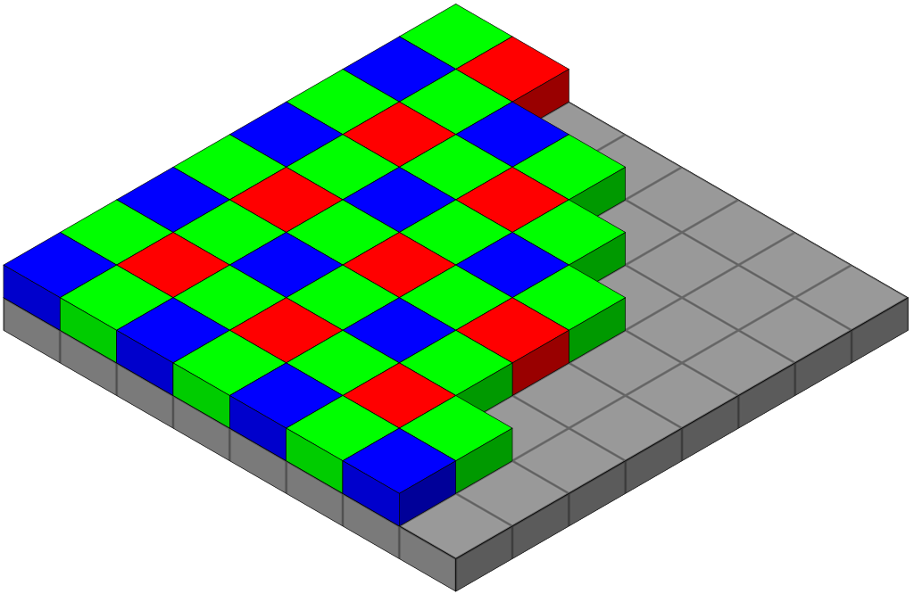

# Reproduction Paper of: 'GenISP: Neural ISP for Low-Light Machine Cognition'

Authors: 
- Thijs Exterkate 
- Tim Hoevenaar
- Jesse Tolen

This reproduction was part of the course CS4240 Deep Learning at Delft University of Technology

The original paper can be found at: https://arxiv.org/abs/2205.03688

## Introduction

Most studies in the computer vision community use image data that is already processed by the traditional Image Signal Processor (ISP) that is specific for every camera. However, these ISP pipelines are typically not suited for processing low-light images. Based on the findings of the paper, for low-light data; object detectors that use raw sensor data have better performance than detectors using data that is processed by a traditional ISP pipeline.

Therefore, the paper proposes to train an ISP pipeline, which they call GenISP. The GenISP pipeline first operates on the raw RGB image, which is a sensor-specific color space to one camera. The sensor-specific color space is mapped to a device-independent color space. This enables the model to better generalize to unseen camera sensors because it operates on the image in a device-independent color space. The device-independent image is then processed through three neural network modules: ConvWB, ConvCC and Shallow ConvNet. This whole pipeline outputs an image that is optimized for any off-the-shelf object detector. Thus, an object detector does not require any fine-tuning to camera specific sensor data.

## Dataset
The dataset we used was the same as provided by the authors of the paper. The dataset includes bounding box annotations for people, bicycles, and cars. As our only goal was to reproduce results associated with the sony part of the dataset and the total dataset was quite large, only the sony dataset was downloaded. Even though the dataset is freely available via a google drive link, acquiring it is not as easy as it seems. Because the zipped file is very large, the download always stops after about an hour of downloading. We circumvented this by using an internet download manager which continues where it left off after a download crashes. The Sony part of the dataset is shot on a Sony RX100 and contains 3.2K images. Because initially we only wanted to reproduce the procedure and because of limited computing capacity we only used a small subset of the data. All data was collected via the github page “RAW-NOD” (https://github.com/igor-morawski/RAW-NOD). Additionally the annotation files were also downloaded from this page.

## Preprocessing of Raw Images
Since the authors propose a low-light image processing method that is device independent we first have to preprocess raw images. This preprocessing consist of extracting color information of the original raw image with colors represented in a sensor specific Bayer pattern (raw-RGB), averaging the green patterns  and repacking to get an rgb color representation and finally applying the CST matrix contained in the raw image data to get a device independent color space a device independent color space (CIE XYZ). 

As there was no real application of this process shown in the paper we had to reproduce the preprocessing with just the terms and order of application. Starting the color extraction and green channel averaging we found out through the internet that information in raw camera files is represented in a device specific pattern. Since the specific camera sensors used for the raw data provided by the authors was also mentioned in the paper we found out that the raw images follow a Bayer pattern(RGGB). In the preprocessing function available in the python file “dataset_class.py” on our github this information is incorporated by extracting raw data in this pattern after which the green channels are averaged. 

 
After restacking the restacked colors are matrix multiplied with a CST matrix available inside the raw data to get a (CIE XYZ) device independent color space. Since the output of this whole preprocessing had values in the hundreds, the preprocessed images were not displayable by any package in python and also not desirable as all the pixels were interpreted as white or black and therefore not ready for further manipulation. To resolve this the images are normalized by subtracting black levels of the raw data and dividing the outcome by the difference between the white and black levels. This is a common practice in image processing, but was not mentioned in the paper and therefore made the reproduction a little bit harder. 

## Image Correction

## Training
[use of retinanet(?)]
